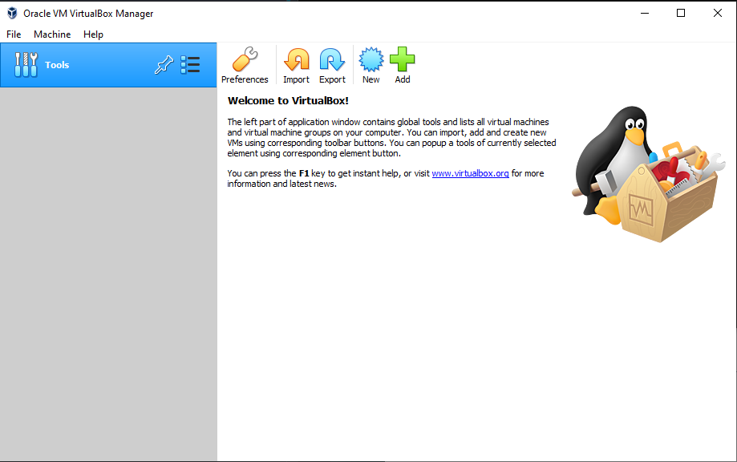
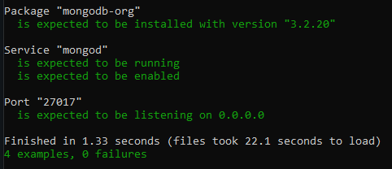

# Vagrant MongoDB Task

The purpose of this repo is to create a mongodb ready virtual machine. This machine will automate the entire process of initialisation a machine with the necessary files, programs and configuration.

## Prerequisites

You will need the following software installed and working in order to follow along.

- [Ruby](https://www.ruby-lang.org/en/downloads/)
- [Vagrant](https://www.ruby-lang.org/en/downloads/)
- [VirtualBox](https://www.virtualbox.org/wiki/Downloads)
- [Visual Studio Code](https://code.visualstudio.com/download) or any other light-weight IDE.
- Download or Clone this repo and have it saved somewhere easily accessible.

## First Steps

Ensure that the applications are installed correctly. To do this simple open your command prompt / terminal / bash depending on your OS and type in the following command and check if the results are similar to the ones specified below.

Command:

```bash
ruby --version
```

Result:

```bash
ruby 2.7.2p137 (2020-10-01 revision 5445e04352) [x64-mingw32]
```

Command:

```bash
vagrant --version
```

Result:

```bash
Vagrant 2.2.13
```

## Virtual Box

Open your virtual box and ensure that its on in the background for the rest of the progress.



## Instructions

### Testing

In order to make sure we have all the correct dependencies installed we need to run a test that will check if anything is missing.
</br>
To run our test we need to navigate to a subfolder containing a `Rakefile`, in our case its in `tests` folder. After this we can run `rake spec` that will test if our dependencies are installed on our machine. This test is expected to fail so do not fear an output that will be all red.

### Important Note

It is important to remember that the `mongod.conf` file needs to be in the same place as `Vagrantfile` as it will be copied by vagrant to the correct location for it to replace the default file and pass the tests.

### Virtual Machine

Now that our tests have been ran. We can initialise our machine. Return back to our root folder (`cd ..` twice). From here run `vagrant up`. This will initalise our machine and run the necessary code to add some of the dependancies that failed earlier. After this process is complete we need to return back to our `tests` and run our tests again. We will see that now, that all the tests passed successfully.



### SSH

If we return once again to our root folder, we can now safely use `vagrant ssh` to connect to our machine and perform necessarily actions.

### Provision.sh Explained

The provision.sh file has a set of instructions that automate the entire process of installing and using the mongodb.

1. First two lines add mongodb to a listed repository for our `apt-get` to have access to so we can easily access it later with that same command.
2. `sudo apt-get update` updates our repository list so it fetches all the applications available for us to install.
3. `sudo apt-get install -y mongodb-org=3.2.20` as per our test requirements, we need to install the 3.2.20 version of mongodb. For that we can use the `apt-get install` with the `-y` flag to confirm the installation. We can also use `=` to explicitly tell `apt-get` to install that version fo mongodb.
4. `sudo cp` this step is important. Our test requires our mongodb to be listening on ip address of `0.0.0.0` by default this ip is set to `127.0.0.8` for this reason this repository has an edited version of the configuration file, and before starting the mongodb service, it copies our modified configuration file to the location of the default file and replaces it.
5. `sudo systemctl enable mongod.service --now` this enables the mongodb service and makes it so everytime the machine is started mongodb service is started too. This is also part of the test requirements and will also automatically start the `mongod` service. As a result passing all the tests.
